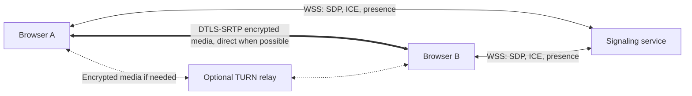

# Private Meeting

A focused, account-free, one-to-one video meeting application. Create a link, check your camera and microphone, and invite one other person. Includes mute, camera controls, screen sharing, receive-only participation, connection states, and a responsive dark interface.

## Architecture

- **Frontend:** React, TypeScript, Vite. Native WebRTC; no hosted video SDK.
- **Signaling:** a small Node.js + `ws` service, with ephemeral in-memory rooms. No database or accounts.
- **Hosting:** static frontend on GitHub Pages (or another static host); signaling on a separate, always-on WebSocket-capable host. Pages alone cannot run this backend.

This repository started empty. A tiny server was chosen to keep admission enforcement and cleanup explicit, locally testable, and free of database credentials or managed-service policies. Firebase/Supabase are not required. The frontend is static; the complete application is not serverless.



### Connection flow

1. The browser generates a 192-bit room capability using `crypto.getRandomValues`. It is stored only in the URL fragment, never in a public directory.
2. Pre-join device access happens only when the user clicks **Enable camera & microphone**. Audio and video are requested independently, so one permission failure does not block the other. The optional name only labels the user's own preview and stays in React memory.
3. Join opens a WebSocket. The server atomically admits at most two sockets per room; the third receives **Meeting room is full.** Opening a preview does not reserve a seat.
4. The first admitted participant is the offerer. Once there are two members, the server assigns a fresh session ID and sends the deterministic roles.
5. The offerer creates audio/video transceivers, including for receive-only users; the answerer attaches its tracks to the transceivers in the received offer. The offerer sends SDP; the answerer applies it and responds. Trickle ICE is queued until a remote description exists. Per-peer processing is serialized; duplicate message IDs, unexpected SDP roles and stale sessions are ignored.
6. ICE selects a usable route. Media flows through the WebRTC transport, never through the signaling server.
7. Microphone/camera controls toggle track `enabled`. Screen sharing replaces the video sender's track without rebuilding the connection. Native **Stop sharing** restores the camera track (or a null track for camera-free participants). Camera mute is preserved across restoration. Screen audio is intentionally not captured.
8. Leaving/unmounting stops tracks and closes sockets/peers. Refresh releases the seat; the remaining participant waits and can connect to a replacement with a new session. A transport failure stops media and offers an explicit rejoin. Temporary WebRTC disconnections can recover for up to 35 seconds; this MVP does not implement automatic ICE restarts.

### Code map

- `src/main.tsx`, `src/pages/`, `src/components/`, `src/styles.css`: pages, accessible controls and responsive layout.
- `src/meeting/controller.ts`: room lifecycle, UI state, recovery and resource ownership.
- `src/media/devices.ts`: preview acquisition, permission errors, screen capture and track cleanup.
- `src/webrtc/peer.ts`, `config.ts`: negotiation, early ICE queue, deduplication, centralized ICE settings and sender track replacement.
- `src/signaling/client.ts`: WebSocket transport and connection deadline.
- `shared/protocol.ts`: bounded, validated signaling message schema.
- `server/app.ts`, `rooms.ts`: origin checks, admission, presence, heartbeats, relay and cleanup.
- `tests/`: utility, protocol, peer and real WebSocket integration tests; browser tests under `tests/e2e/`.
- `.github/workflows/pages.yml`: manually triggered Pages deployment, with checks first.
- `Dockerfile`: optional production signaling container.

## Local development

Use Node.js **22.12+** and npm. From this repository:

```sh
npm install
cp .env.example .env.local
```

In one terminal:

```sh
npm run dev:server
```

In another:

```sh
npm run dev
```

Open **http://localhost:5173**. The default signaling URL is `ws://localhost:8787/signal`. The backend does not load `.env` files automatically; export its variables or set them through your hosting platform. Do not use the example's `NODE_ENV=development` in production.

Validation:

```sh
npm run typecheck
npm run lint
npm test
npm run build
npm run build:server
npx playwright install chromium
npm run test:e2e
npm run test:pages
```

The browser suite starts both local services, uses synthetic Chromium camera/microphone devices, and saves desktop/tablet/mobile screenshots to `test-results/`. A canvas stream simulates the screen picker; actual RTP sender replacement and restoration run in the native peer connection. Test-only Chromium flags permit loopback ICE and disable mDNS masking so local networking is deterministic; production browser settings are unchanged. Synthetic local tests are not a substitute for real-device or TURN testing. The browser tests use dedicated ports 5198 and 8798 and refuse to reuse an existing server. To preview the production frontend with a local backend, build with `VITE_SIGNALING_URL=ws://localhost:8787/signal`, run `npm run preview`, and include `http://localhost:4173` in the signaling server's `ALLOWED_ORIGINS`.

## Configuration

See `.env.example`. Vite reads frontend variables at **build time**; restart development or rebuild after changing them. Every `VITE_*` value is public in the shipped JavaScript.

- `VITE_SIGNALING_URL`: complete `wss://your-signaling-host/signal` endpoint in production. Development defaults to local WS. A production build without this setting shows an actionable configuration error when joining.
- `VITE_BASE_PATH`: defaults to `./`. Relative asset paths plus hash routing support both a domain root and `https://USERNAME.github.io/REPOSITORY/`.
- `VITE_STUN_URL`: comma-separated STUN URLs. Default: `stun:stun.l.google.com:19302`. An explicit empty string disables STUN. Use your own service if you prefer; using the default exposes network metadata to Google's STUN service.
- `VITE_TURN_URL`: optional comma-separated `turn:`/`turns:` URLs (for example UDP and TLS transports).
- `VITE_TURN_USERNAME`, `VITE_TURN_CREDENTIAL`: required with TURN URLs. These are client credentials, visible to users, even if configured as a GitHub Actions secret. Never use a provider API key, service-account key, TURN shared secret, or master credential here. For public production, implement a trusted credential endpoint that issues short-lived, scoped TURN credentials and fetch them before creating a peer; this MVP's build-time settings alone do not provide credential rotation.
- `PORT`: signaling port, default `8787`.
- `ALLOWED_ORIGINS`: server-only comma-separated exact frontend origins, with scheme and optional port, **no path or trailing slash**. For this repository on Pages: `https://irenex86.github.io`. Multiple origins support migration/custom domains. Production startup requires explicit HTTPS origins.
- `NODE_ENV=production`: enables strict production origin configuration. TLS termination still belongs to the hosting service/reverse proxy.

## Signaling hosting setup

Deploy one instance of this repository's Node signaling service on a host that supports persistent WebSocket connections and TLS. No Firebase/Supabase setup, database, or privileged application secret is needed.

Native Node deployment:

```sh
npm ci
npm run build:server
NODE_ENV=production ALLOWED_ORIGINS=https://irenex86.github.io PORT=8787 npm start
```

Or build the included Docker image, then run it with the same environment variables:

```sh
docker build -t private-meeting-signaling .
docker run --rm -p 8787:8787 -e ALLOWED_ORIGINS=https://irenex86.github.io private-meeting-signaling
```

Configure the host's HTTPS reverse proxy to forward `/signal` WebSocket upgrades to port 8787 and `/health` for health checks. Use an idle timeout longer than the 15-second heartbeat, automatic restarts, and one always-on instance. Put your resulting `wss://HOST/signal` into the frontend environment. Container commands do not provision TLS by themselves.

The server intentionally stores rooms in a single process. Do not enable multiple replicas or rolling instances without adding a shared admission/routing layer; two independent processes cannot enforce the same room's capacity. A server restart loses ephemeral rooms and interrupts calls, requiring rejoin. Cold-sleep hosting adds latency and can exceed the client's 12-second signaling deadline.

The server has a 64 KiB WebSocket payload limit, bounded SDP/candidate fields, a 200-message burst allowance refilling at 25 messages/second per connection, output buffering limits, a 10-second admission deadline, a 2,200-socket cap, and a 1,000-room cap. It checks exact browser origins, routes only between admitted members, validates negotiation roles, and refuses binary messages. Heartbeats reclaim dead sockets in approximately 15–30 seconds. Empty rooms disappear immediately. There is no room-list endpoint and no persistent SDP/ICE storage.

Origin validation is not user authentication: non-browser clients can spoof it. Add connection/IP quotas, rate limits, TLS, and abuse protection at your reverse proxy for public deployment; do not trust forwarded IP headers unless configured by that proxy. Room links grant access to an available seat. This MVP has no host approval, passwords, identity verification, permanent room expiry, or waiting-room moderation. A connected visitor can keep a seat until they disconnect. Links can be reused after a call; create a new link for a new private conversation.

## GitHub Pages deployment

Nothing deploys automatically on push. When you are ready to publish:

1. Host the signaling server as described above. Set its `ALLOWED_ORIGINS` to `https://irenex86.github.io` (not the repository URL path).
2. Commit/push the reviewed local files yourself to `IreneX86/PrivateMeeting`.
3. In **Settings → Pages → Build and deployment**, choose **GitHub Actions**.
4. In **Settings → Secrets and variables → Actions → Variables**, create `VITE_SIGNALING_URL` with your `wss://HOST/signal`. Optionally create `VITE_STUN_URL`, `VITE_TURN_URL`, and `VITE_TURN_USERNAME`. If using static TURN client credentials, store `VITE_TURN_CREDENTIAL` as an Actions secret to avoid printing it in setup—but it will still be public in the build.
5. Open **Actions → Deploy frontend to GitHub Pages → Run workflow**, select your reviewed branch, and run it. Approve the `github-pages` environment if your repository requires that.
6. Open `https://irenex86.github.io/PrivateMeeting/`, create a meeting, and share the generated `https://irenex86.github.io/PrivateMeeting/#/room/<192-bit-id>` URL.

Hash routing means the server only receives `/PrivateMeeting/`; direct link openings and refreshes do not ask Pages to resolve a nonexistent `/room/` path. Always share the generated hash link. Non-hash `/room/...` URLs are not supported. Relative assets work under project paths without changing the bundle. See [Vite's Pages deployment guidance](https://vite.dev/guide/static-deploy#github-pages) and [GitHub's publishing-source instructions](https://docs.github.com/en/pages/getting-started-with-github-pages/configuring-a-publishing-source-for-your-github-pages-site).

### Custom domain and personal website

Later, configure the domain in **Settings → Pages → Custom domain**, add GitHub's required DNS records at your provider, and enable **Enforce HTTPS** once the certificate is ready. Add your new `https://meet.example.com` origin to the signaling allowlist. If you manage a CNAME through the build artifact, create `public/CNAME` containing only your domain before deploying. Relative asset paths and fragment routes work at the domain root. Existing links on the old origin depend on the redirect you configure.

Link from a personal GitHub website using an ordinary anchor:

```html
<a href="https://irenex86.github.io/PrivateMeeting/" target="_blank" rel="noopener noreferrer"
  >Start a private meeting</a
>
```

A direct link is simplest. If embedding in an iframe later, both the parent Permissions Policy and iframe `allow="camera; microphone; display-capture"` must permit media; browser support and screen-capture restrictions vary. This MVP does not require embedding.

## Privacy and security properties

- Browser WebRTC uses DTLS-SRTP encrypted media transport. Direct connectivity is attempted; TURN, when needed, forwards encrypted packets rather than decoding call media.
- The signaling service receives connection metadata, SDP, ICE candidates, and presence. It never receives raw camera/microphone media. It does not record, transcribe, upload call contents, or perform media processing.
- No accounts, cookies for identity, analytics, trackers, remote fonts, persistent profiles, or database. The optional preview name is not sent to the peer or service. The app does not request screen audio.
- Room IDs are high-entropy bearer capabilities. Anyone with a link can join if there is capacity. The fragment is not sent in ordinary HTTP requests; it is intentionally sent over WSS when joining. URLs can still leak via sharing, screenshots, browser history, extensions, or copied text.
- Peers can learn each other's network addresses. The STUN/TURN and hosting operators can observe IP addresses, timestamps and traffic metadata; a TURN relay also observes encrypted packet flow. Infrastructure logs outside this app may persist metadata—configure them appropriately.
- Encryption does **not** authenticate the identity of the other participant or protect against a compromised browser, frontend, signaling service, malicious extension, or malicious participant. There is no out-of-band fingerprint verification. A participant can record externally. This is not anonymity, immunity from monitoring, or an absolute-security guarantee.
- No privileged secrets are committed. Public frontend configuration must never contain master credentials. Dependencies and hosting require ongoing security maintenance.

## STUN, TURN, and connectivity

STUN helps discover reachable network candidates; it does not forward media. Some NATs, firewalls, VPNs and corporate networks prevent direct connectivity. TURN supplies a relay route and consumes relay bandwidth; configure it for reliable public use. Without TURN, a failed direct connection is expected on some networks, and the UI offers a rejoin with an explanation.

ICE configuration is centralized in `src/webrtc/config.ts`. The default policy permits direct and relay routes and uses no candidate prefetch before joining. For debugging, temporarily setting `iceTransportPolicy: 'relay'` in that function with working TURN configuration forces a relay route; undo after testing if you want direct connectivity when possible.

## Manual verification checklist

1. On device A, open the HTTPS site (localhost is allowed for local development), **Create Meeting**, enable devices, check the preview, and copy the link.
2. On device B, open the link, enable devices, and join. Join on A. Both should say **Connected**, show the other person's video and play audio. Use headphones to avoid feedback. Opening two windows on one device can compete for camera access, depending on the OS/browser.
3. Mute/unmute A and verify B hears the difference. Toggle A's camera; B should stop receiving live camera imagery. Toggle both controls in pre-join too.
4. Share A's screen. B should see it. Stop with both the in-app button and the browser's native stop control; B should see the camera again. Repeat with the camera muted and with no camera device. Mobile browsers may not support screen capture.
5. Open a third tab and join: it must show **Meeting room is full.**
6. Refresh B. A should wait; B can rejoin through preview. Leave A; camera/microphone capture should stop and B should return to waiting. Close tabs, navigate home, and leave while permission prompts are pending to check cleanup.
7. Deny permissions, disable one device, disconnect a device, deny the screen picker, try an invalid link, stop the signaling server, and test a network disconnection. Errors should stay actionable, without a blank page.
8. Test at phone/tablet/desktop sizes, keyboard-only navigation, and on two separate networks. For a second physical device during local development, `localhost` refers to that device: use HTTPS development hosting/tunneling for the frontend and WSS signaling, with the correct allowlist. Plain LAN HTTP usually cannot access camera/microphone.

### Inspect the selected route

Open `chrome://webrtc-internals` **before** joining in Chrome/Edge. Find the peer connection, its selected/nominated `candidate-pair`, then the referenced local and remote candidate reports. `host`, `srflx` (server-reflexive), and `prflx` are non-relay candidates; `relay` indicates TURN use. Inspect the selected pair, not merely the list of gathered candidates. Increasing inbound/outbound RTP bytes/frames indicate media flow. Firefox provides `about:webrtc`. These diagnostics contain sensitive connection metadata—redact before sharing.

### Permission and browser troubleshooting

Camera/microphone require HTTPS in production; localhost is a secure-context exception. Allow the site in browser settings and the browser app in OS privacy settings, close other apps holding the camera, then use **Retry camera & microphone** in preview. `NotAllowedError` may also mean an OS block or insecure context. If joining with no devices, you can receive the peer; leave and rejoin to acquire devices later.

Current Chromium, Firefox and Safari generally support the core APIs, but test your exact versions. iOS needs inline playback; the app sets `playsInline`. If autoplay is blocked, tap **Play video & audio**. Browser-native screen capture requires a direct user action and may be unavailable on mobile/Safari configurations. Backgrounding a mobile browser or locking the phone may suspend the call or socket; return and rejoin if necessary. System audio capture, device selectors, mobile background calls, automatic reconnection, multi-party calls, and recording are outside scope.

API references: [MDN: replacing sender tracks](https://developer.mozilla.org/en-US/docs/Web/API/RTCRtpSender/replaceTrack), [MDN: adding remote ICE candidates](https://developer.mozilla.org/en-US/docs/Web/API/RTCPeerConnection/addIceCandidate).

## Verification performed

On 24 September 2026 with Node 22.23.2 and Chromium 153:

- TypeScript checks, ESLint, frontend production build, and signaling-server build passed.
- 18 unit/integration tests passed, including real local WebSocket admission/routing and cleanup, early ICE, duplicate signals, offered-transceiver reuse, room IDs, ICE config, and late media cleanup.
- 3 browser scenarios passed: local two-context WebRTC with synthetic media, both participants replacing/restoring screen tracks, full-room rejection, mute/camera controls, refresh/rejoin, capture cleanup, permission-denial UI, and responsive layouts at 360/768/1440 pixels.
- A production-bundle smoke test passed for asset loading, room-link generation, refresh and fresh shared-link opening under `/PrivateMeeting/`, with no SPA fallback.
- Dependency audit reported no known vulnerabilities at verification time.

Not verified: physical cameras/microphones, two separate physical devices/networks, a real browser screen-picker/native UI, TURN credentials or relay connectivity, Safari/Firefox/mobile devices, Docker runtime, or an actual public deployment. Follow the manual checklist before relying on public calls.
