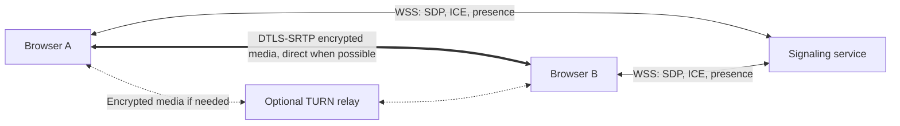

# Private Meeting

A focused, account-free, one-to-one video meeting application. Create a link, check your camera and microphone, and invite one other person. Includes mute, camera controls, screen sharing, receive-only participation, connection states, and a responsive dark interface.

## Architecture

- **Frontend:** React, TypeScript, Vite. Native WebRTC; no hosted video SDK.
- **Signaling:** a small Node.js + `ws` service, with ephemeral in-memory rooms. No database or accounts.
- **Hosting:** static frontend on GitHub Pages (or another static host); signaling on a separate, always-on WebSocket-capable host. Pages alone cannot run this backend.

This repository started empty. A tiny server was chosen to keep admission enforcement and cleanup explicit, locally testable, and free of database credentials or managed-service policies. Firebase/Supabase are not required. The frontend is static; the complete application is not serverless.



### Connection flow

1. The browser generates a 192-bit room capability using `crypto.getRandomValues`. It is stored only in the URL fragment, never in a public directory.
2. Pre-join device access happens only when the user clicks **Enable camera & microphone**. Audio and video are requested independently, so one permission failure does not block the other. The optional name only labels the user's own preview and stays in React memory.
3. Join opens a WebSocket. The server atomically admits at most two sockets per room; the third receives **Meeting room is full.** Opening a preview does not reserve a seat.
4. The first admitted participant is the offerer. Once there are two members, the server assigns a fresh session ID and sends the deterministic roles.
5. The offerer creates audio/video transceivers, including for receive-only users; the answerer attaches its tracks to the transceivers in the received offer. The offerer sends SDP; the answerer applies it and responds. Trickle ICE is queued until a remote description exists. Per-peer processing is serialized; duplicate message IDs and ICE contents, unexpected SDP roles and stale sessions are ignored.
6. ICE selects a usable route. Media flows through the WebRTC transport, never through the signaling server.
7. Microphone/camera controls toggle track `enabled`. Screen sharing replaces the video sender's track without rebuilding the connection. Native **Stop sharing** restores the camera track (or a null track for camera-free participants). Camera mute is preserved across restoration. Screen audio is intentionally not captured.
8. Leaving/unmounting stops tracks and closes sockets/peers. Refresh releases the seat; the remaining participant waits and can connect to a replacement with a new session. A transport failure stops media and offers an explicit rejoin. Temporary WebRTC disconnections show **Reconnecting** and can recover for up to 35 seconds; persistent failures show **Connection failed** and a **Try again** button. Rejoin deliberately returns through preview; this MVP does not implement automatic ICE restarts.

### Code map

- `src/main.tsx`, `src/pages/`, `src/components/`, `src/styles.css`: pages, accessible controls and responsive layout.
- `src/meeting/controller.ts`: room lifecycle, UI state, recovery and resource ownership.
- `src/media/devices.ts`: preview acquisition, permission errors, screen capture and track cleanup.
- `src/webrtc/peer.ts`, `config.ts`: negotiation, early ICE queue, deduplication, centralized ICE settings and sender track replacement.
- `src/signaling/client.ts`: WebSocket transport and connection deadline.
- `shared/protocol.ts`: bounded, validated signaling message schema.
- `server/app.ts`, `rooms.ts`, `config.ts`, `limits.ts`: strict configuration, admission, bounded abuse controls, proxy trust, presence, heartbeats, shutdown, relay and cleanup.
- `tests/`: utility, protocol, peer and real WebSocket integration tests; browser tests under `tests/e2e/`.
- `.github/workflows/pages.yml`: manually triggered Pages deployment, with checks first.
- `Dockerfile`: optional production signaling container.

## Local development

Use Node.js **22.12+** and npm. From this repository:

```sh
npm install
cp .env.example .env.local
```

In one terminal:

```sh
npm run dev:server
```

In another:

```sh
npm run dev
```

Open **http://localhost:5173**. The default signaling URL is `ws://localhost:8787/signal`. The backend does not load `.env` files automatically; export its variables or set them through your hosting platform. Do not use the example's `NODE_ENV=development` in production.

Validation:

```sh
npm run typecheck
npm run lint
npm test
npm run build
npm run build:server
npx playwright install chromium
npm run test:e2e
npm run test:pages
```

The browser suite starts both local services, uses synthetic Chromium camera/microphone devices, and saves desktop/tablet/mobile screenshots to `test-results/`. A canvas stream simulates the screen picker; actual RTP sender replacement and restoration run in the native peer connection. Test-only Chromium flags permit loopback ICE and disable mDNS masking so local networking is deterministic; production browser settings are unchanged. Synthetic local tests are not a substitute for real-device or TURN testing. The browser tests use dedicated ports 5199 and 8799 and refuse to reuse an existing server. To preview the production frontend with a local backend, build with `VITE_SIGNALING_URL=ws://localhost:8787/signal`, run `npm run preview`, and include `http://localhost:4173` in the signaling server's `ALLOWED_ORIGINS`.

## Configuration

See `.env.example`. Vite reads frontend variables at **build time**; restart development or rebuild after changing them. Every `VITE_*` value is public in the shipped JavaScript.

- `VITE_SIGNALING_URL`: complete `wss://your-signaling-host/signal` endpoint in production. Development defaults to local WS. The Pages workflow rejects missing or invalid settings before building. For other production builds, run `npm run validate:production` before `npm run build`; it reads Vite production environment files and process overrides without printing values. A plain local build still permits an unconfigured bundle for routing tests, with an actionable error on joining.
- `VITE_BASE_PATH`: defaults to `./`. Relative asset paths plus hash routing support both a domain root and `https://USERNAME.github.io/REPOSITORY/`.
- `VITE_STUN_URLS`: comma-separated STUN URLs. Default: `stun:stun.l.google.com:19302`. An explicit empty string disables STUN. Use your own service if you prefer; using the default exposes network metadata to Google's STUN service. The previous `VITE_STUN_URL` spelling remains a fallback only if `VITE_STUN_URLS` is absent; migrate existing settings to the plural name.
- `VITE_TURN_URL`: optional comma-separated `turn:`/`turns:` URLs (for example UDP and TLS transports).
- `VITE_TURN_USERNAME`, `VITE_TURN_CREDENTIAL`: required with TURN URLs. These are client credentials, visible to users, even if configured as a GitHub Actions secret. Never use a provider API key, service-account key, TURN shared secret, or master credential here. For public production, implement a trusted credential endpoint that issues short-lived, scoped TURN credentials and fetch them before creating a peer; this MVP's build-time settings alone do not provide credential rotation.
- `PORT`: signaling port, default `8787`.
- `ALLOWED_ORIGINS`: server-only comma-separated exact frontend origins, with scheme and optional port, **no path or trailing slash**. For this repository on Pages: `https://irenex86.github.io`. Multiple origins support migration/custom domains. Production startup requires explicit HTTPS origins. Paths, trailing slashes, credentials, wildcards, malformed URLs and non-canonical origins are rejected at startup.
- `NODE_ENV=production`: enables strict production origin configuration. TLS termination still belongs to the hosting service/reverse proxy.
- `MAX_ROOMS`: maximum in-memory rooms, default `1000`, allowed `1–10000`.
- `MAX_CONNECTIONS`: maximum WebSocket connections, default `2200`, allowed `1–20000`. Raw TCP connections are additionally capped at this value plus 64.
- `MAX_CONNECTIONS_PER_IP`: simultaneous connections per effective source, default `20`, allowed `1–20000`. Shared NATs/proxies share this budget; adjust deliberately if needed.
- `CONNECTIONS_PER_MINUTE`: source connection-attempt burst capacity and per-minute refill, default `60`, allowed `1–10000`. Failed upgrade attempts count too; opening a new socket cannot reset this budget.
- `TRUSTED_PROXY_IPS`: optional comma-separated **exact IP addresses** of your controlled reverse proxies. Empty by default. IPv4-mapped IPv6 addresses are normalized. No wildcard or CIDR syntax is accepted. See proxy setup below.

Frontend and backend settings are separated in `.env.example`. The backend validates all numeric limits; `PORT` must be an integer from `1` to `65535`. Do not copy development origins into production.

## Signaling hosting setup

Minimum backend requirements: Node 22.12+ (or Docker), a persistent process with WebSocket upgrade support, a public hostname, HTTPS/WSS termination, and environment-variable configuration. Deploy one instance of this repository's Node signaling service on a host meeting these requirements. No Firebase/Supabase setup, database, or privileged application secret is needed.

Native Node deployment:

```sh
npm ci
npm run build:server
NODE_ENV=production ALLOWED_ORIGINS=https://irenex86.github.io PORT=8787 npm start
```

Or build the included Docker image, then run it with the same environment variables:

```sh
docker build -t private-meeting-signaling .
docker run --rm -p 8787:8787 -e ALLOWED_ORIGINS=https://irenex86.github.io private-meeting-signaling
```

Configure the host's HTTPS reverse proxy to forward `/signal` WebSocket upgrades to port 8787 and `/health` for health checks. Use a proxy idle timeout of at least 60 seconds, automatic restarts, and one always-on instance. Forward the `Upgrade`/`Connection` headers and preserve the browser `Origin` header. `/health` accepts GET/HEAD with no room data; it is unavailable during shutdown. Put your resulting `wss://HOST/signal` into the frontend environment. Container commands do not provision TLS by themselves.

The server intentionally stores rooms in a single process. Do not enable multiple replicas or rolling instances without adding a shared admission/routing layer; two independent processes cannot enforce the same room's capacity. A server restart loses ephemeral rooms and interrupts calls, requiring rejoin. Cold-sleep hosting adds latency and can exceed the client's 12-second signaling deadline.

The server has a 64 KiB WebSocket payload limit, bounded and whitelisted SDP/candidate fields, a 200-message burst allowance refilling at 25 messages/second per connection, a separate 256 KiB byte burst refilling at 64 KiB/second, output buffering limits, a 10-second admission deadline, a default 2,200-socket cap, and a default 1,000-room cap. It checks exact browser origins, routes only between admitted members, validates negotiation roles, and refuses binary messages. Heartbeats reclaim dead sockets in approximately 15–30 seconds. Empty rooms disappear immediately. There is no room-list endpoint and no persistent SDP/ICE storage.

Origin validation is not user authentication: non-browser clients can spoof it. The built-in source/connection/message/byte limits are a first layer; keep TLS and network-level abuse protection at the reverse proxy for public deployment. These controls are not distributed DDoS protection. Room links grant access to an available seat. This MVP has no host approval, passwords, identity verification, permanent room expiry, or waiting-room moderation. A connected visitor can keep a seat until they disconnect. Links can be reused after a call; create a new link for a new private conversation.

### Proxy trust, bounded state, and graceful shutdown

The backend listens on `0.0.0.0:$PORT` behind HTTPS/WSS termination. It does not require `X-Forwarded-Proto` or attempt to terminate TLS itself. With `TRUSTED_PROXY_IPS` empty, it ignores `X-Forwarded-For` and applies source quotas to the direct socket address, which may be your proxy. To attribute quotas to visitors, list only known proxy IPs, restrict ingress to those proxies, and configure each proxy to overwrite or correctly append `X-Forwarded-For`. The server walks the chain from the direct peer right-to-left, trusting only listed hops and stopping at the first untrusted address. It ignores malformed or oversized chains. Never blindly trust arbitrary forwarding headers. For a provider with changing proxy addresses, use provider-supported edge quotas and a deliberately configured per-proxy budget until a reliable trust boundary is available.

The source-limit cache is capped at 10,000 entries. It retains source addresses only in process memory while active or for approximately two idle minutes, then removes them on the heartbeat sweep; addresses are never logged or stored on disk. Room state is capped and empty rooms are deleted. Client-side ICE deduplication and outgoing buffering are bounded too.

SIGTERM/SIGINT stop new admissions, send WebSocket close code **1001**, and allow up to **5 seconds** for close handshakes. Remaining WebSockets and raw/incomplete HTTP sockets are then destroyed so shutdown cannot hang indefinitely. Repeated shutdown requests are idempotent. Configure a host/container stop grace of at least 10 seconds. Docker starts Node directly as PID 1 so it receives signals, rather than hiding it behind an npm parent. A restart still ends calls and requires users to rejoin; this is intentional for single-process ephemeral rooms.

Application logs contain only generic startup/shutdown/configuration/listen errors. There is no SDP, ICE, room ID, name, media, request URL or IP logging. Production negotiation errors shown in the UI are generic rather than raw browser SDP parsing errors. Your reverse proxy, hosting provider and TURN service have independent logs: disable request-body/WebSocket payload capture and limit retention. Use browser-local WebRTC diagnostics for troubleshooting; do not add payload dumps to production logs.

## GitHub Pages deployment

Nothing deploys automatically on push. The manual workflow runs TypeScript, lint, unit/integration tests, browser tests, configuration validation, the frontend/server builds and the built Pages copy-link/reload smoke check before publishing. When you are ready to publish:

1. Host the signaling server as described above. Set its `ALLOWED_ORIGINS` to `https://irenex86.github.io` (not the repository URL path).
2. Commit/push the reviewed local files yourself to `IreneX86/PrivateMeeting`.
3. In **Settings → Pages → Build and deployment**, choose **GitHub Actions**.
4. In **Settings → Secrets and variables → Actions → Variables**, create `VITE_SIGNALING_URL` with your `wss://HOST/signal`. Optionally create `VITE_STUN_URLS`, `VITE_TURN_URL`, and `VITE_TURN_USERNAME`. If using static TURN client credentials, store `VITE_TURN_CREDENTIAL` as an Actions secret to avoid printing it in setup—but it will still be public in the build.
5. Open **Actions → Deploy frontend to GitHub Pages → Run workflow**, select your reviewed branch, and run it. Approve the `github-pages` environment if your repository requires that.
6. Open `https://irenex86.github.io/PrivateMeeting/`, create a meeting, and share the generated `https://irenex86.github.io/PrivateMeeting/#/room/<192-bit-id>` URL.

Hash routing means the server only receives `/PrivateMeeting/`; direct link openings and refreshes do not ask Pages to resolve a nonexistent `/room/` path. Always share the generated hash link. Non-hash `/room/...` URLs are not supported. Relative assets work under project paths without changing the bundle. See [Vite's Pages deployment guidance](https://vite.dev/guide/static-deploy#github-pages) and [GitHub's publishing-source instructions](https://docs.github.com/en/pages/getting-started-with-github-pages/configuring-a-publishing-source-for-your-github-pages-site).

### Custom domain and personal website

Later, configure the domain in **Settings → Pages → Custom domain**, add GitHub's required DNS records at your provider, and enable **Enforce HTTPS** once the certificate is ready. Add your new `https://meet.example.com` origin to the signaling allowlist. If you manage a CNAME through the build artifact, create `public/CNAME` containing only your domain before deploying. Relative asset paths and fragment routes work at the domain root. Existing links on the old origin depend on the redirect you configure.

Link from a personal GitHub website using an ordinary anchor:

```html
<a href="https://irenex86.github.io/PrivateMeeting/" target="_blank" rel="noopener noreferrer"
  >Start a private meeting</a
>
```

A direct link is simplest. If embedding in an iframe later, both the parent Permissions Policy and iframe `allow="camera; microphone; display-capture"` must permit media; browser support and screen-capture restrictions vary. This MVP does not require embedding.

## Privacy and security properties

- Browser WebRTC uses DTLS-SRTP encrypted media transport. Direct connectivity is attempted; TURN, when needed, forwards encrypted packets rather than decoding call media.
- The signaling service receives connection metadata, SDP, ICE candidates, and presence. It never receives raw camera/microphone media. It does not record, transcribe, upload call contents, or perform media processing.
- No accounts, cookies for identity, analytics, trackers, remote fonts, persistent profiles, or database. The optional preview name is not sent to the peer or service. The app does not request screen audio.
- Room IDs are high-entropy bearer capabilities. Anyone with a link can join if there is capacity. The fragment is not sent in ordinary HTTP requests; it is intentionally sent over WSS when joining. URLs can still leak via sharing, screenshots, browser history, extensions, or copied text.
- Peers can learn each other's network addresses. The STUN/TURN and hosting operators can observe IP addresses, timestamps and traffic metadata; a TURN relay also observes encrypted packet flow. Infrastructure logs outside this app may persist metadata—configure them appropriately.
- Encryption does **not** authenticate the identity of the other participant or protect against a compromised browser, frontend, signaling service, malicious extension, or malicious participant. There is no out-of-band fingerprint verification. A participant can record externally. This is not anonymity, immunity from monitoring, or an absolute-security guarantee.
- No privileged secrets are committed. Public frontend configuration must never contain master credentials. Dependencies and hosting require ongoing security maintenance.

## STUN, TURN, and connectivity

STUN helps discover reachable network candidates; it does not forward media. Some NATs, firewalls, VPNs and corporate networks prevent direct connectivity. TURN supplies a relay route and consumes relay bandwidth; configure it for reliable public use. Without TURN, a failed direct connection is expected on some networks, and the UI offers a rejoin with an explanation.

ICE configuration is centralized in `src/webrtc/config.ts`. The explicit `iceTransportPolicy: 'all'` permits direct and relay routes and uses no candidate prefetch before joining. ICE normally prefers a viable direct route; a working call by itself does not prove that route was selected. TURN is a connectivity fallback, not application-layer anonymity. For debugging, temporarily setting `iceTransportPolicy: 'relay'` in that function with working TURN configuration forces a relay route; undo after testing if you want direct connectivity when possible.

## Exact two-device test procedure

Do this after you explicitly authorize staging deployment (or provide a private HTTPS frontend and WSS backend accessible to both devices). Local automated tests do not replace this procedure. Use headphones and open `chrome://webrtc-internals` before joining on Chromium desktop devices.

1. **Device A — Sydney/Australia, Wi-Fi:** open `https://irenex86.github.io/PrivateMeeting/`, click **Create Meeting**, enable camera/microphone, confirm your preview, and copy the invite. Check it starts with `https://irenex86.github.io/PrivateMeeting/#/room/`.
2. **Device B — another device and network:** open the exact shared URL, enable devices, check preview, and click **Join Meeting**. Join on A. Both should show **Connected**, display the other person's live video and play their speech. Verify both directions separately; a moving local preview proves neither outbound transport nor remote audio.
3. **Audio/video:** mute A and confirm B cannot hear A; unmute and confirm audio returns. Repeat on B. Turn each camera off/on and verify the remote image stops/returns. The app never records these tests.
4. **Screen:** share a harmless test window from A, then B. Verify the other device sees the selected surface. Stop using both the app button and the browser's own Stop sharing control. Camera video should return, with its previous mute state preserved. Repeat camera-off and camera-unavailable cases. Unsupported mobile browsers should give an actionable message.
5. **Capacity:** while A/B are joined, open a third device/tab and click **Join Meeting**. It must show **Meeting room is full.** A preview alone does not reserve a seat.
6. **Refresh/leave:** refresh B. A should return to waiting; B should see preview and be able to rejoin. Leave A; camera/microphone capture indicators should clear and B should wait. Rejoin A through preview. Test leaving while the screen picker is open and immediately after selecting a surface; no capture should remain after leaving.
7. **Recovery:** briefly interrupt one device's network. If the browser reports transient media disconnection, the UI should show **Reconnecting** and return to **Connected** if transport recovers within 35 seconds. A failed ICE or signaling connection ends capture and shows **Connection failed**; use **Try again** to return through preview. This app does not promise automatic ICE restarts, automatic socket rejoin, or seamless Wi-Fi-to-cellular handoff. A dead peer's server seat can take roughly 15–30 seconds to be reclaimed.
8. **Permissions/lifecycle:** deny camera only, microphone only, then both; try retry and receive-only joining. Unplug a device. Navigate home/close the tab. Background/lock a phone and return. Confirm actionable states and no orphaned capture.
9. **Repeat network combinations:** Wi-Fi ↔ Wi-Fi on different routers/ISPs, then Wi-Fi ↔ a laptop connected through a mobile hotspot. Same-router Wi-Fi is a useful baseline but insufficient. Repeat on the actual desktop/mobile browsers you intend to support. If direct connectivity fails, configure TURN and repeat; do not label that a direct P2P success.

For physical devices during local development, `localhost` refers to each device itself. Use HTTPS frontend hosting/tunneling and a reachable WSS endpoint, with the exact frontend origin in `ALLOWED_ORIGINS`. A plain HTTP LAN address generally cannot access camera/microphone.

### Verify the selected ICE route

In `chrome://webrtc-internals`, find the active peer connection. Inspect the transport's **selected candidate pair** (or nominated, succeeded pair in older reports), then follow its local/remote candidate IDs. Inspect the chosen pair, not just the list of gathered candidates:

- `host`: interface/local or directly reachable candidate; it can be a LAN/public address or mDNS hostname.
- `srflx`: NAT-mapped candidate discovered through STUN.
- `prflx`: peer-reflexive candidate discovered by connectivity checks.
- `relay`: candidate supplied by TURN. If either side of the selected pair is `relay`, the route uses a TURN relay.

A selected pair with no relay candidates indicates a non-TURN route for that transport. It does not establish anonymity or hide metadata. **A successful call or the Connected label alone is not proof of direct P2P.** Increasing inbound/outbound RTP bytes, decoded frames and audio stats help confirm actual media delivery. Firefox offers `about:webrtc`. Do not publish raw diagnostics: they can contain IPs, SDP and connection metadata.

### Permission and browser troubleshooting

Camera/microphone require HTTPS in production; localhost is a secure-context exception. Allow the site in browser settings and the browser app in OS privacy settings, close other apps holding the camera, then use **Retry camera & microphone** in preview. `NotAllowedError` may also mean an OS block or insecure context. If joining with no devices, you can receive the peer; leave and rejoin to acquire devices later.

Current Chromium, Firefox and Safari generally support the core APIs, but test your exact versions. iOS needs inline playback; the app sets `playsInline`. If autoplay is blocked, tap **Play video & audio**. Browser-native screen capture requires a direct user action and may be unavailable on mobile/Safari configurations. Backgrounding a mobile browser or locking the phone may suspend the call or socket; return and rejoin if necessary. System audio capture, device selectors, mobile background calls, automatic reconnection, multi-party calls, and recording are outside scope.

API references: [MDN: replacing sender tracks](https://developer.mozilla.org/en-US/docs/Web/API/RTCRtpSender/replaceTrack), [MDN: adding remote ICE candidates](https://developer.mozilla.org/en-US/docs/Web/API/RTCPeerConnection/addIceCandidate).

## Verification performed

On 24 September 2026 with Node 22.23.2 and Chromium 153:

- TypeScript checks, ESLint, frontend production build, and signaling-server build passed.
- 42 unit/integration tests passed, including room/protocol boundaries, source and byte limits, proxy spoofing, graceful/bounded shutdown and the production SIGTERM entrypoint, early and duplicate ICE, offered-transceiver reuse, late socket callbacks, and screen-share lifecycle races.
- 4 browser scenarios passed: local two-context WebRTC with synthetic media, both participants replacing/restoring screen tracks, full-room rejection, mute/camera controls, refresh/rejoin, capture cleanup, permission-denial UI, signaling-loss capture cleanup/manual rejoin, and responsive layouts at 360/768/1440 pixels.
- A production-bundle smoke test passed for asset loading, actual copy-button URL generation, refresh and fresh shared-link opening under `/PrivateMeeting/`, with no SPA fallback.
- Dependency audit reported no known vulnerabilities at verification time.

Not verified: physical cameras/microphones, two separate physical devices/networks, a real browser screen-picker/native UI, TURN credentials or relay connectivity, Safari/Firefox/mobile devices, Docker runtime, or an actual public deployment. Follow the manual checklist before relying on public calls.

## Deployment readiness

- **Signaling server:** implementation is ready for a controlled single-instance deployment after configuring the public host, TLS/WSS proxy, allowlist, quotas and proxy trust. Infrastructure behavior still needs staging verification.
- **GitHub Pages:** implementation is ready after the WSS endpoint is provisioned and `VITE_SIGNALING_URL` is set. Project-path links and assets are verified locally; the remote Actions workflow has not been executed.
- **Real two-device testing:** application and test procedure are ready. Execute the checklist once both devices can access an authorized HTTPS/WSS environment. Restrictive-network readiness remains conditional on working TURN and real-device results.

Recommended next step: review these local changes, then explicitly authorize a staging signaling-host setup. Verify `/health`, an allowed-origin WSS connection, rejected origins and graceful host restart before configuring/running Pages deployment. No commit, push or deployment was performed as part of this review.
